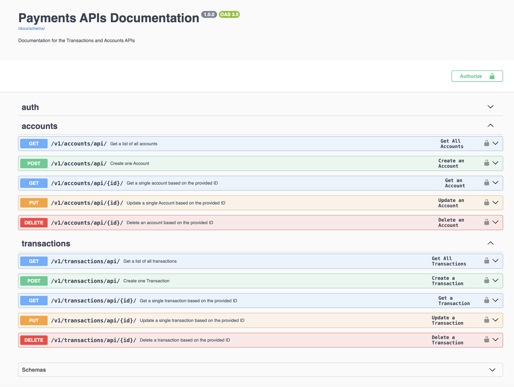

# Payments APIs
A Django Project with 2 apps - Transactions API and Accounts API.

The project uses a very simplified version of payment transaction processing, focusing on the accounts and transactions between the accounts. There are typically more parties involved in payment processing, but this project's scope is account-based payments i.e., no intermediaries like credit or debit cards are involved.

## Project Structure
- transactions_api has all the files for the Transactions API, including the functions for generating the Swagger documentation
- accounts_api has all the files for the Accounts API, including the functions for generating the Swagger documentation
- the tests subdirectory in each of the app's contains the tests for the models and the views
- the payments/payments/utils contains the common functions, variables and classes used across both apps

## Future enhancements
There is a backlog of features for the APIs, including additional tests to be included. These are as follows:
- enable filtering and sorting
- update APIs to support PATCH requests
- test multi-step flow requests (POST, GET, PUT, GET)
- update APIs to enable bulk updates
- load testing

## How to run
1. Create a virtual environment:
```
python3 -m venv projectvenv
``` 

2. Activate the virtual environment:

a) Mac
```
source projectvenv/bin/activate
```

b) Windows with CMD
```
.\projectvenv\Scripts\activate.bat
```

c) Windows with PowerShell
```
.\projectvenv\Scripts\activate.ps1
```

d) Windows with Unix like shells e.g., Git Bash CLI
```
source projectvenv/Scripts/activate
```

3. Navigate to the payments subdirectory:
```
cd payments
```

4. Run the tests

a) To run the accounts tests
```
python3 manage.py test accounts_api.tests
```

b) To run the transactions tests:
```
python3 manage.py test transactions_api.tests
```

5. Start the server
```
python3 manage.py runserver
```

## Documentation
If you start the server, this will start the development server at http://127.0.0.1:8000/. This is the base URL.

From the base URL, add the following path 'docs/schema/'. This will redirect you to download a YAML file that contains the documentation for the API.

Alternatively, from the base URL, add the following path 'swagger/schema/'. This will take you to the Swagger Page, which looks like this:




This is an example of how the endpoints are documented for the Accounts API:

